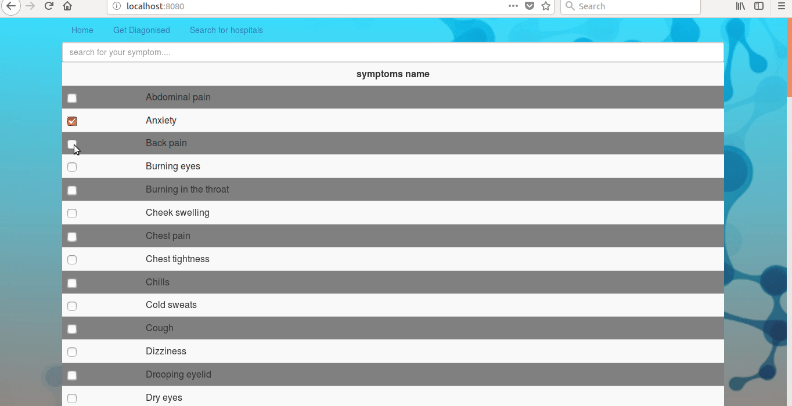

# MEDICIVE
Web app for medical dignosis and treatment suggestion based on symptoms entered by user

### Project Structure
|──────MEDICIVE/  
| |────app.py  
| |────templates/  
| | |────symptom.html  
| | |────diagnosis.html  
| | |────tretement.html  
| | |────search.html  
| | |────select.html  
| | |────diagnosis_bot.html  
| | |────location.html  
| | |────map.html  
| |────config.py  
| |────config_med.py  
| |────static  
| | |────mobile.jpg  
| | |────style.css  
| |────symptom.db  
| |────calls.csv  

- 'app.py' file has code for flask app configuration and controllers for all API (5 APIs given in question).
- 'templates' folder contains html file for view.
- 'static' folder contains static file(images and css file).
- 'config.py' contains config file for Apimedic API. User need to replace the API key with the key they get from [here].(https://apimedic.com/)
- 'config_med.py' contains config file for Infermedica API. User need to replace API key with the key they get from [here].(https://developer.infermedica.com/)
- 'symptom.db' is sqlite3 database.
- 'web_scraped.csv' contains web scarpped contents. It will be created at the time of web scrapping.

### Getting Started

#### How to run this project on your local machine 
1) Download zip or clone it using 'git clone https://github.com/kumarijyotsna/MEDICIVE.git'
2) Unzip the downloaded zip file
3) Run command 'pip install requirements.txt' to install all the required dependencies
4) Run the project by command 'flask run'

#### Prerequisites
1) Python2.7
2) Python3.5
3) Flask
4) sqlite3
5) jinja2 template

### Built with
This project has been built using 
1) Language Used: Python2.7
2) Backend : Flask
3) Database: sqlite3
4) Frontend: HTML, CSS, Bootstrap, jinja2
5) Dependency management: pip
6) API Used: Apimedic, Infermedica

#### 'app.py' has all the 5 APIs given in question

